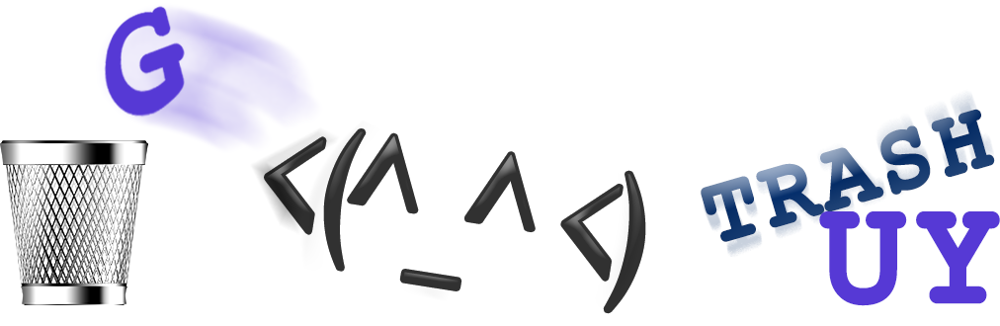

# TrashGuy

The [REDACTED] TrashGuy script, written in NodeJS/Javascript!

---
## Requirements

For development, you will only need Node.js and a node global package installed in your environment.

### Node
- #### Node installation on Windows

  Just go on [official Node.js website](https://nodejs.org/) and download the installer.
Also, be sure to have `git` available in your PATH, `npm` might need it (You can find git [here](https://git-scm.com/)).

- #### Node installation on Ubuntu

  You can install nodejs and npm easily with apt install, just run the following commands.

      $ sudo apt install nodejs
      $ sudo apt install npm

- #### Other Operating Systems
  You can find more information about the installation on the [official Node.js website](https://nodejs.org/) and the [official NPM website](https://npmjs.org/).

If the installation was successful, you should be able to run the following command.

    $ node --version
    v12.8.0

    $ npm --version
    6.10.2

If you need to update `npm`, you can make it using `npm`! Cool right? After running the following command, just open again the command line and be happy.

    $ npm install npm -g

###

## Install

    $ npm install trashguy

## Usage Examples

**Command line:**

SOONtm

**NodeJS module:**

    from trashguy import TrashGuy

    console.log(TrashGuy('A B C'))  # input must be a string
    console.log(TrashGuy('📂', '📊', '✉'))  # or an array

**Node module as iterator:**
    
    const { TrashGuy } = require("trashguy")
    
    for (const pos of new TrashGuy('A B C')) {
        console.log(pos)
    }

**Setting custom symbols with keyword arguments and printing as a newline-joined string:**

    trashAnimation = new TrashGuy(userInput,{
                               spriteCan:'\u2A06',
                               spriteLeft:'<(-.- <)',
                               spriteRight:'(> -.-)>',
                               spacer:TrashGuy.Symbols.SPACER_EMOJI,
                               wrapper:TrashGuy.Symbols.WRAPPER_BLOCK_MONO})  # triple backticks

    console.log(trashAnimation)  # outputs entire animation with each frame separated by newline

#

Like what you see?
---------------------------
⭐ Star the repository and share with your friends! ⭐

*Really* like what you see?
---------------------------
*Feel free to donate so we can get some marshmallows* 😁
